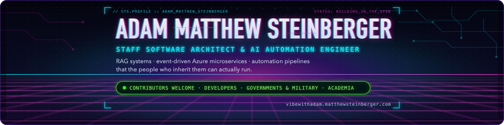

<picture>
  <source media="(prefers-color-scheme: dark)" srcset="assets/banner-dark.png">
  
</picture>

# Adam Matthew Steinberger

**Staff Software Architect & AI Automation Engineer** — I build AI systems that actually work inside enterprise environments: production-grade platforms that handle real data, real security requirements, and real organizational complexity. Not just demos. I am also the creator and maintainer of [The Vibey Project](https://github.com/the-vibey-project/vibey), an open-source conductor for reliable agentic software delivery.

    

Based in Greenville, SC. Looking for **Staff Software Architect · AI Automation Engineer · Staff/Principal AI Engineer · Solutions Architect · Platform/Automation Engineer** roles — Greenville-remote or US-remote, W2 preferred, contract-to-hire OK.

**→ [Everything a hiring manager needs](https://vibewithadam.matthewsteinberger.com/hire-me)** · [Email me](mailto:adam@matthewsteinberger.com) · [Ask my résumé](https://vibewithadam.matthewsteinberger.com/) (a Claude RAG widget I built)

## What I ship

Proof, not promises. Every number below is from a real engagement; client identities stay out of it.

- **[The Vibey Project](https://github.com/the-vibey-project/vibey)** — creator and maintainer. A queue-based, six-phase conductor that takes a change from spec interview through design, build, review, and optional deployment across Claude Code, OpenAI Codex, Cursor Agent, Google Antigravity/Gemini, and local Qwen. One `pip install vibey` ships the family: append-only PostgreSQL ledger, leased idempotent jobs, deterministic no-loss handoffs, sovereign-first review, billing-aware feasibility, and continuous delivery estimates.
- **[AI Governance Gateway](https://vibewithadam.matthewsteinberger.com/work/ai-governance-gateway)** — sole architect. Five model vendors (Azure AI, Anthropic, OpenAI/Codex, Cursor, Grok, Gemini) behind one policy-enforced, OpenAI-compatible API: per-project USD spend caps, multi-unit rate limiting, HMAC-signed hash-chained audit trail, no API keys in the path. Three product teams migrated onto it; their credentials retired.
- **[AI Payroll Processor](https://vibewithadam.matthewsteinberger.com/work/enterprise-ai-payroll-processor)** — co-lead. 20 microservices, four human-approved phases, 585 test modules, Terraform/Helm/GitOps on private AKS. Architecture production-ready at day 45; a junior dev trained in parallel now owns it.
- **[Identity Governance as Code](https://vibewithadam.matthewsteinberger.com/work/identity-governance-as-code)** — sole author. Two control planes reconciling tenant state from Git: a kopf operator with fully secretless multi-tenant auth and LLM-drafted PRs, and an IdP governance platform managing 40 resource kinds via six addressing patterns, human-gated destructive drift, point-in-time reversion.
- **[Multi-System Ticket Relay](https://vibewithadam.matthewsteinberger.com/work/multi-system-ticket-relay)** — sole author. N-way sync with no privileged hub: version vectors, echo suppression, a conflict engine that fails to manual hold. 653 tests, 93% coverage, import-linter-enforced pure domain, property/mutation/chaos-tested convergence.
- **[Technical Report Generation Platform](https://vibewithadam.matthewsteinberger.com/work/ai-report-generator-email-intake)** — lead. Instrument data → standards-aware deliverables: event-driven ingestion, multi-vendor parsers, deterministic analysis + LLM review, SAML 2.0 SSO, deploys that prove they rolled out.
- **[Self-Hosted RAG Chatbot](https://vibewithadam.matthewsteinberger.com/work/self-hosted-rag-chatbot)** — Mistral-7B, FAISS, vLLM, Docker. Zero external dependencies, shipped in 30 days.
- **[GodFocus Push Notifications](https://vibewithadam.matthewsteinberger.com/work/godfocus-push-notifications)** — TDD Web Push system. 159/159 tests, 85.84% coverage, 5 billable hours.

Underneath: secretless DevSecOps (OIDC workload identity across 20 CI workflows in 9 repos; SAST, SCA, IaC scanning, SBOM, keyless signing, policy admission), five formal architecture document sets, identity-governance advisory for a SOX-regulated enterprise, and the *Security-First Scrum* framework.

All 17 case studies → **[/work](https://vibewithadam.matthewsteinberger.com/work)**

## Open source — one monorepo, one distribution

The Vibey Project consolidated the former runner and tooling repositories into one
MIT-licensed uv workspace and one release. The components keep their own contracts,
tests, and architecture, but a user installs the family once.

| Component | What it is | Links |
|---|---|---|
| **`vibey`** | The conductor and the release that contains the whole family. | [PyPI](https://pypi.org/project/vibey/) · [repo](https://github.com/the-vibey-project/vibey) · [docs](https://the-vibey-project.github.io/vibey/main/) |
| **`claudeloop` · `codexloop` · `cursorloop` · `agyloop` · `qwenloop`** | Five interchangeable session runners: Claude Code, OpenAI Codex, Cursor, Google Antigravity/Gemini, and fully local Qwen 2.5 Coder. | [runner source](https://github.com/the-vibey-project/vibey/tree/develop/src/vibey_runners) |
| **`vibey-gh`** | Stdlib-first GitHub automation: provenance, exact-head review, merge train, release promotion, paper/book exports, and feasibility/forecast reporting. | [source](https://github.com/the-vibey-project/vibey/tree/develop/src/vibey_tools/gh) |
| **`vibey-skills`** | A deterministic Claude Code marketplace with 135 plugins and 710 evidence-grounded skills. | [source](https://github.com/the-vibey-project/vibey/tree/develop/src/vibey_tools/skills) |
| **`vibey-bootstrap`** | The optional Azure Functions cross-cutting layer, used across 17+ repositories. | [source](https://github.com/the-vibey-project/vibey/tree/develop/src/vibey_tools/bootstrap) |
| **`clippy-pet`** | An animated paperclip pet for ChatGPT desktop and Codex CLI. Because not everything has to be serious. | [repo](https://github.com/adammatthewsteinberger/clippy-pet) |

More → **[/open-source](https://vibewithadam.matthewsteinberger.com/open-source)**

The project publishes the formal research paper and the complete documentation book as
HTML, PDF, EPUB, and print HTML surfaces. Editable DOCX exports are in the current
development release and will be published with the next documentation release:
[paper](https://the-vibey-project.github.io/vibey/main/paper/) ·
[book](https://the-vibey-project.github.io/vibey/main/) ·
[source](https://github.com/the-vibey-project/vibey/tree/develop/docs).

## Contribute

I primarily develop free and open-source software, and I'm always open for a connection or a coffee — Greenville-remote or US-remote volunteers are welcome and encouraged to get involved at any time. Everything a developer needs to get started (a free quickstart for the whole stack, how my own site is built with it, and where to begin) is at **[/join-me](https://vibewithadam.matthewsteinberger.com/join-me)** · [adam@matthewsteinberger.com](mailto:adam@matthewsteinberger.com)

## Writing

> *"The AI is a commodity. The knowledge is the competitive asset."*

**[Novice to Navigator: Your Guide to AI Chatbots for Business](https://vibewithadam.matthewsteinberger.com/novice-to-navigator)** — plain-English, numerate, no hype. How RAG actually works, what makes chatbots succeed or fail, and how to decide whether your business is ready. The first edition's 33 chapters are free to read; the second edition is in development.

- 📖 [Read the first edition free](https://vibewithadam.matthewsteinberger.com/novice-to-navigator)
- ✅ [15-factor Chatbot Readiness Quiz](https://vibewithadam.matthewsteinberger.com/novice-to-navigator/readiness) — four pillars, ~30 minutes, before you sign a contract
- 🔔 [Get notified when the second edition ships](https://eepurl.com/jiYXCQ)

Also in development: *Engineering Influence* — see **[/books](https://vibewithadam.matthewsteinberger.com/books)**.

**Latest posts**
<!-- BLOG-POST-LIST:START -->
- [Fable 5, Mythos 5, and a 19-Day Pause: What &#39;Mythos-Class&#39; Means for Your RAG Budget](https://vibewithadam.matthewsteinberger.com/blog/claude-fable-5-mythos-5-and-what-mythos-class-means-for-rag) — Aug 14, 2026
- [Microsoft Foundry at Build 2026: What Actually Changes for Azure Architects](https://vibewithadam.matthewsteinberger.com/blog/microsoft-foundry-build-2026-what-changes-for-azure-architects) — Aug 12, 2026
- [MCP Became the REST of Agents. Here&#39;s How I&#39;d Expose a Legacy System to One Safely.](https://vibewithadam.matthewsteinberger.com/blog/mcp-became-the-rest-of-agents-safely-exposing-a-legacy-system) — Aug 10, 2026
- [Astra Solved 10 Open Math Problems for $2,000. ChatGPT Hit 1 Billion Users. Neither Changes the Advice I Give Clients.](https://vibewithadam.matthewsteinberger.com/blog/astra-1-billion-users-and-why-the-knowledge-base-is-the-moat) — Aug 5, 2026
<!-- BLOG-POST-LIST:END -->

## How I work

**Architecture before code. Juniors trained in parallel. Handoffs that hold.** I document as I build for the same reason a RAG pipeline cites its sources: an auditable trail beats a confident guess six months later. That's why the AI Payroll Processor transferred to a junior dev in 45 days instead of becoming someone's permanent second job.

- **Depth on the details that matter** — I find the one row that contradicts the other nine hundred instead of averaging it away
- **Onion Architecture and TDD by default** — 159/159 tests and 85.84% coverage on the GodFocus push system, in 5 billable hours
- **Cross-cutting concerns solved once** — `vibey-bootstrap` is the config/logging/Service Bus layer factored out of 17+ Azure Functions repos
- **Process engineering alongside the code** — Epics → Features → Stories decomposition, so the work stays legible to the people funding it
- **Sovereignty with evidence** — local engines are preferred when enabled, paid capacity is a fallback, and every handoff, review, estimate, and spend record remains inspectable in the ledger

More → [my story](https://vibewithadam.matthewsteinberger.com/story) · [hire me](https://vibewithadam.matthewsteinberger.com/hire-me)

## Now

- Senior Azure & AI Development Engineer, **The Vizius Group**, Sep 2025 – Aug 2026. **Available from September 2026.**
- Creator and maintainer of **The Vibey Project**, actively shipping the monorepo, its research paper, and its documentation book.
- Volunteer software architect for a nonprofit AI apologetics chat platform since Apr 2026 — the AI→human live-chat relay is written up at [/work/project-excite-relay](https://vibewithadam.matthewsteinberger.com/work/project-excite-relay).
- Hiring for a business rather than an engineering team? The executive edition of my site states the problem first → [/for-executives](https://vibewithadam.matthewsteinberger.com/for-executives)
- B.A. Computer Science, Skidmore College (2012) · Certified ScrumMaster (2021)

<strong>Stack at a glance</strong>

- **Languages:** Python · TypeScript/NestJS · C#/.NET · React/Next.js
- **Azure:** Functions · Service Bus · App Configuration · Key Vault · Application Insights · AKS · Bicep
- **Platform:** Docker · Kubernetes · Helm · GitOps · GitHub Actions · Azure DevOps · Bitbucket
- **Data:** PostgreSQL/pgvector · MongoDB · Snowflake · Redis
- **AI:** RAG · vLLM · Ollama · FAISS · LangChain · MCP · Claude · GPT · Gemini · Mistral · LoRA fine-tuning · Grafana/Prometheus for LLM observability
- **Practice:** Onion Architecture · TDD · Scrum (CSM) · process engineering · Jira decomposition (Epics → Features → Stories)

<strong>Also comfortable with…</strong>

- Self-hosted services: WordPress, Listmonk/Postfix/OpenDKIM, Matrix/Element, Ghost, bare-metal Ubuntu
- Privacy-first stacks and Big-Tech alternatives (Proton, GrapheneOS, System76, Synology)
- Proof-of-Stake validator operations (ETH2/Rocketpool) and self-custody training

## Contact

[adam@matthewsteinberger.com](mailto:adam@matthewsteinberger.com) · [LinkedIn](https://www.linkedin.com/in/adammatthewsteinberger/) · [vibewithadam.matthewsteinberger.com](https://vibewithadam.matthewsteinberger.com/) · [RSS](https://vibewithadam.matthewsteinberger.com/feed.xml) · [llms.txt](https://vibewithadam.matthewsteinberger.com/llms.txt)

---

This profile is [CC BY 4.0](LICENSE) · the site behind it is open source: [adammatthewsteinberger/portfolio](https://github.com/adammatthewsteinberger/portfolio) (MIT code, CC BY 4.0 content) · [/join-me](https://vibewithadam.matthewsteinberger.com/join-me)
