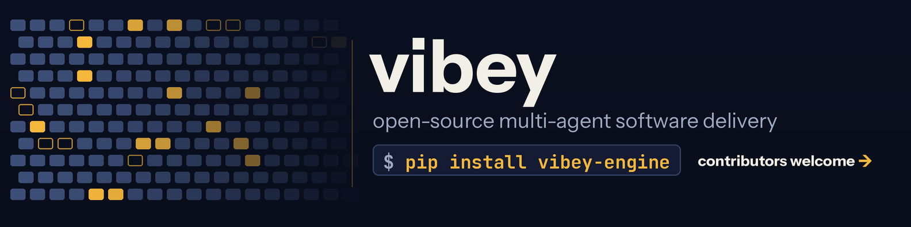

<a href="https://github.com/the-vibey-project/vibey"></a>

# Adam Matthew Steinberger

**Staff Software Engineer — AI platforms, identity, and agent orchestration.** I build the infrastructure that lets AI run inside organizations that have to answer for it: secretless identity, policy-enforced model gateways, and audit trails that hold up to review. I also maintain **[vibey](https://github.com/the-vibey-project/vibey)**, an MIT-licensed conductor that carries a software change from spec to reviewed pull request across a pool of AI coding agents, and loses nothing when one of them fails.

[](https://pypi.org/project/vibey-engine/) [](https://the-vibey-project.github.io/vibey/main/paper/) [](https://vibewithadam.matthewsteinberger.com/freelance) [](https://vibewithadam.matthewsteinberger.com/hire-me) [](https://github.com/adammatthewsteinberger/resume/raw/main/adam-steinberger-resume.pdf) [](https://www.linkedin.com/in/adammatthewsteinberger/)

Greenville, South Carolina · US remote · [adam@matthewsteinberger.com](mailto:adam@matthewsteinberger.com)

**Find your way in:** [help build vibey](#contribute) · [bring a fixed-scope project](#fixed-scope-projects-built-from-work-already-delivered) · [hire me for a Staff+ role](#open-to-staff-roles)

## vibey: delivery that survives the agent

You have probably used an AI coding agent and then babysat it: re-prompting when it lost the thread, re-explaining everything after a crash, watching a run die at 2 a.m. because one vendor's credits ran out. The agent was autonomous. The delivery was you.

vibey is the layer that does the babysitting. It interviews you until the spec is sharp, builds unattended across several engines, brings you back only for the decisions that are yours, and survives crashes and credit exhaustion without dropping an open question.

```bash
pip install vibey-engine   # Python 3.12+, PostgreSQL 14+, macOS or Linux
```

- **Nothing is lost when an agent dies.** Every decision, finding and handoff is a row in an append-only PostgreSQL ledger, and workers claim jobs under `FOR UPDATE SKIP LOCKED` leases. In the chaos test, 8 workers ran 500 jobs with 20% killed mid-job. None were lost and none ran twice.
- **Handoffs are checked, not trusted.** Work moving from one engine to another must pass a model-free no-loss check, or it retries, escalates, or parks for a person.
- **A human decision is a record, not a blocked terminal.** Approval gates are rows in the ledger and parked jobs, so nothing sits waiting on stdin.
- **Five engines, one contract.** Claude Code, OpenAI Codex, Cursor Agent, Google Antigravity, and local open-weight models. When local engines are enabled, they go first.

**Read the design before the code:** [research paper](https://the-vibey-project.github.io/vibey/main/paper/) ([PDF](https://the-vibey-project.github.io/vibey/main/paper.pdf)) · [documentation book](https://the-vibey-project.github.io/vibey/main/) ([PDF](https://the-vibey-project.github.io/vibey/main/book.pdf)) · [architecture decisions](https://github.com/the-vibey-project/vibey/tree/develop/docs/architecture/decisions)

| One install, five components | What it does |
|---|---|
| [Conductor](https://github.com/the-vibey-project/vibey/tree/develop/src/vibey) | The six-phase delivery machine: design, build, review, and opt-in deployment. CLI and TUI. |
| [Engine runners](https://github.com/the-vibey-project/vibey/tree/develop/src/vibey_runners) | `claudeloop`, `codexloop`, `cursorloop`, `agyloop`, and the local runner. Each one tells an exhausted rate-limit window apart from exhausted credits and resumes across usage windows. |
| [`vibey-gh`](https://github.com/the-vibey-project/vibey/tree/develop/src/vibey_tools/gh) | Release automation for any GitHub repository: provenance, exact-head AI review, a merge train, and branch promotion. This profile repo runs it. |
| [`vibey-skills`](https://github.com/the-vibey-project/vibey/tree/develop/src/vibey_tools/skills) | A Claude Code plugin marketplace of Agent Skills in which every claim cites its source. |
| [`vibey-bootstrap`](https://github.com/the-vibey-project/vibey/tree/develop/src/vibey_tools/bootstrap) | Azure, telemetry, configuration and Service Bus foundations, solved once. |

### Contribute

The project is small enough that one good pull request gets noticed. The CI gates handle formatting, coverage and layering, so review can stay on your design.

1. **Say hello or ask anything** in [Discussions](https://github.com/the-vibey-project/vibey/discussions). No question is too basic.
2. **Pick something from the [open issues](https://github.com/the-vibey-project/vibey/issues).** Two good places to start: [Fedora support](https://github.com/the-vibey-project/vibey/issues/1188) and [new skills for vibey-skills](https://github.com/the-vibey-project/vibey/issues/1218). Comment before you start anything large, so we can agree on the shape first.
3. **Set up with the [contributing guide](https://github.com/the-vibey-project/vibey/blob/develop/CONTRIBUTING.md):** `uv sync`, two hook installs, and a local PostgreSQL. CI runs the same gates you run locally.
4. **Open a pull request against `develop`.** Use Conventional Commits; the provenance hook adds the trailer for you.

Rather talk first? Email me or start at **[/join-me](https://vibewithadam.matthewsteinberger.com/join-me)**. Contributors in Greenville and anywhere in the US are welcome, and I'm glad to pair on a first change.

Also mine, and deliberately not serious: **[clippy-pet](https://github.com/adammatthewsteinberger/clippy-pet)**, an animated paperclip for the ChatGPT desktop app and Codex CLI.

## Fixed-scope projects, built from work already delivered

You have an AI feature to ship, a codebase to trust, or an audit on the calendar. It needs doing once, and doing right. Each package below is something I have already delivered in production, and each one names what you receive.

| Package | What you receive | Done before |
|---|---|---|
| **AI codebase and security review** | A technical brief with every finding ranked by risk, an executive summary, and a phased roadmap with effort estimates | 59,000 lines across 190+ files reviewed in 10 hours; found 5% test coverage and missing auth middleware ([case study](https://vibewithadam.matthewsteinberger.com/work/chosen-people-answers-architecture)) |
| **A production RAG chatbot in 30 days** | A chatbot grounded in your documents, hosted on your cloud or entirely on your own servers, with monitoring and a runbook | Two shipped in 30 days each, one fully self-hosted on Mistral-7B, FAISS and vLLM ([case study](https://vibewithadam.matthewsteinberger.com/work/self-hosted-rag-chatbot)) |
| **An LLM cost and policy gateway** | One OpenAI-compatible API in front of your model vendors, with per-project allowlists, spend caps and a tamper-evident audit trail | Sole architect of a gateway in front of six vendors; three product teams moved onto it ([case study](https://vibewithadam.matthewsteinberger.com/work/ai-governance-gateway)) |
| **Okta or Entra ID identity governance** | Access rules declared in Git, drift detection that holds destructive changes for a person, and an access model mapped to your audit | Two governance-as-code control planes, 40 resource kinds, no stored tenant secrets ([case study](https://vibewithadam.matthewsteinberger.com/work/identity-governance-as-code)) |
| **SOC 2 or OWASP LLM Top 10 readiness for an AI feature** | A STRIDE threat model, a control map to the OWASP LLM Top 10 and NIST AI RMF, and a ranked gap list with a fix for each gap | A SOC 2 readiness assessment and threat model, and gateway controls mapped to both frameworks ([case study](https://vibewithadam.matthewsteinberger.com/work/ai-report-generator-email-intake)) |

What you can count on, in writing:

- **A written brief starts it.** You answer a short questionnaire on your schedule, and I reply with a written scope. Calls are welcome whenever they help; no step waits on one.
- **Scope, price and "done" are fixed before work begins.** Every milestone closes against an acceptance checklist, and any change arrives as a written note you accept or decline.
- **You never have to ask where things stand.** I reply in two set windows each business day (US Eastern), send a status note at every milestone, and keep a risk register you can read.
- **Your project gets steady attention.** I take on no more than three engagements at a time.
- **AI-assisted, and said so up front.** I build with AI coding agents under the same gates vibey uses, and I review and sign off every deliverable myself.

**[See the full packages and send a brief →](https://vibewithadam.matthewsteinberger.com/freelance)** Prices are quoted per package in your written scope, or on my Upwork and Fiverr Pro listings as they go live. If we meet on a platform, the whole engagement stays on that platform.

## Production work

Built as a senior engineer at a consulting firm and as an independent consultant. Client names are left out; each numbered claim comes from a real engagement.

- **[AI governance gateway](https://vibewithadam.matthewsteinberger.com/work/ai-governance-gateway)** (sole architect). One OpenAI-compatible, policy-enforced API in front of Azure AI, Anthropic, OpenAI, Cursor, Grok and Gemini. It enforces per-project allowlists, multi-unit rate limits, per-call USD cost attribution with spend caps, and an HMAC-signed, hash-chained audit trail. Callers authenticate with workload identity, so no API key sits in the request path. **Three product teams migrated onto it and retired their app-held credentials.**
- **[Identity governance as code](https://vibewithadam.matthewsteinberger.com/work/identity-governance-as-code)** (sole author of two control planes). The first is a kopf operator that reconciles directory state from Git with no stored tenant secrets, and has an LLM draft pull requests for judgment calls. The second is an IdP governance platform managing 40 resource kinds, where safe drift is remediated automatically and destructive drift waits for a person. **Together they replaced a low-code workflow with a versioned, idempotent sync API.**
- **[AI payroll platform](https://vibewithadam.matthewsteinberger.com/work/enterprise-ai-payroll-processor)** (co-lead). 20 microservices across four human-approved phases, with the final submission modeled as irreversible. Terraform, Helm and GitOps on private AKS; 585 test modules. **The architecture was production-ready by day 45, and the junior developer trained alongside it now owns it.**
- **[Multi-system ticket relay](https://vibewithadam.matthewsteinberger.com/work/multi-system-ticket-relay)** (sole author). N-way sync with no privileged hub: version vectors, echo suppression, and a conflict engine that fails safe to manual hold. 653 tests at 93% coverage.
- **[Technical report platform](https://vibewithadam.matthewsteinberger.com/work/ai-report-generator-email-intake)** (lead). Turns instrument data into standards-aware client reports through deterministic analysis plus LLM review, with SAML 2.0 SSO and blocking data-quality gates. **It ended silent false-success deploys.**
- **[Self-hosted RAG chatbot](https://vibewithadam.matthewsteinberger.com/work/self-hosted-rag-chatbot)**. Mistral-7B, FAISS and vLLM with zero external dependencies, shipped in 30 days.

Underneath all of it: OIDC workload identity across 20 CI workflows in 9 repositories; SAST, SCA, IaC scanning, SBOMs, keyless signing and policy-as-code admission; and identity-governance advisory for a SOX-regulated enterprise of about 5,700 identities. **[All case studies →](https://vibewithadam.matthewsteinberger.com/work)**

## How I work

- **Write the decision down before the code.** Architecture decision records, STRIDE threat models and readiness assessments come first, so the reasoning survives the people who made it.
- **Let the gates hold the line.** Branch-coverage floors, import-linter-enforced layers, signed releases and provenance checks in CI mean a rule is enforced rather than remembered.
- **Close security findings before release.** Self-review on recent work caught an auth bypass, a path traversal, an SSRF, a timing-unsafe comparison and an over-scoped CI credential before any of them shipped.
- **Train the person who inherits it.** A handoff counts as finished when someone else runs the system without me.

## Writing

- **[Ledger-Mediated Orchestration: Vendor-Independent Autonomous Software Delivery over a Pool of Coding Agents](https://the-vibey-project.github.io/vibey/main/paper/)**. The design paper behind vibey (not refereed). The repository's "Cite this repository" button gives the citation.
- **[Novice to Navigator: Your Guide to AI Chatbots for Business](https://vibewithadam.matthewsteinberger.com/novice-to-navigator)**. A plain-English, numerate guide to RAG chatbots for decision-makers. The first edition is free to read online, and the [15-factor readiness quiz](https://vibewithadam.matthewsteinberger.com/novice-to-navigator/readiness) takes about 30 minutes.

**Latest posts**
<!-- BLOG-POST-LIST:START -->
- [Fable 5, Mythos 5, and a 19-Day Pause: What &#39;Mythos-Class&#39; Means for Your RAG Budget](https://vibewithadam.matthewsteinberger.com/blog/claude-fable-5-mythos-5-and-what-mythos-class-means-for-rag) — Aug 14, 2026
- [Microsoft Foundry at Build 2026: What Actually Changes for Azure Architects](https://vibewithadam.matthewsteinberger.com/blog/microsoft-foundry-build-2026-what-changes-for-azure-architects) — Aug 12, 2026
- [MCP Became the REST of Agents. Here&#39;s How I&#39;d Expose a Legacy System to One Safely.](https://vibewithadam.matthewsteinberger.com/blog/mcp-became-the-rest-of-agents-safely-exposing-a-legacy-system) — Aug 10, 2026
- [Astra Solved 10 Open Math Problems for $2,000. ChatGPT Hit 1 Billion Users. Neither Changes the Advice I Give Clients.](https://vibewithadam.matthewsteinberger.com/blog/astra-1-billion-users-and-why-the-knowledge-base-is-the-moat) — Aug 5, 2026
<!-- BLOG-POST-LIST:END -->

## Open to Staff+ roles

- **Available now for Staff+ software engineering roles** in AI platform, identity and access, agent infrastructure, and forward-deployed engineering, including regulated and public-sector work. US remote or Greenville, SC. **[Everything a hiring manager needs →](https://vibewithadam.matthewsteinberger.com/hire-me)**
- Maintaining **[The Vibey Project](https://github.com/the-vibey-project)** and taking a small number of [fixed-scope projects](#fixed-scope-projects-built-from-work-already-delivered) alongside it.
- Volunteer software architect for a nonprofit AI chat platform. The AI-to-human live-chat relay is written up at [/work/project-excite-relay](https://vibewithadam.matthewsteinberger.com/work/project-excite-relay).
- Previously Senior Azure and AI Development Engineer at The Vizius Group (Sep 2025 to Aug 2026). Over 13 years in production systems across insurance, fintech, healthcare and industrial testing.
- B.A. Computer Science, Skidmore College · Certified ScrumMaster

<details>
<summary><strong>Stack at a glance</strong></summary>

- **Identity and access:** Microsoft Entra ID · Okta (core, IGA, Workflows) · SAML 2.0 · OIDC/OAuth 2.0 · workload identity federation · RBAC · governance as code
- **Security and compliance:** secretless delivery · Semgrep · CodeQL · Trivy · Checkov · SBOM (Syft/CycloneDX) · Cosign keyless signing · Kyverno/OPA · STRIDE · SOC 2 readiness · OWASP LLM Top 10 · NIST AI RMF
- **AI and LLM systems:** multi-vendor gateways · agent sandboxing and egress policy · multi-agent orchestration · MCP servers · RAG (pgvector, FAISS, Azure AI Search) · Claude · Azure OpenAI/Foundry · GPT · Gemini · vLLM · Ollama
- **Platform:** Kubernetes (AKS, KEDA) · Terraform · Bicep · Helm · Flux/Argo CD · GitHub Actions · Service Bus · OpenTelemetry · PostgreSQL · Redis · AWS
- **Languages:** Python (FastAPI, SQLAlchemy 2, Pydantic, kopf) · TypeScript/NestJS · Next.js/React · C#/.NET · Java Spring Boot · SQL · KQL · Bash

</details>

## Contact

- **Want to contribute?** Start a thread in [vibey's Discussions](https://github.com/the-vibey-project/vibey/discussions).
- **Have a project?** Send the [written brief](https://vibewithadam.matthewsteinberger.com/freelance#brief).
- **Hiring?** Everything is on [/hire-me](https://vibewithadam.matthewsteinberger.com/hire-me).

[adam@matthewsteinberger.com](mailto:adam@matthewsteinberger.com) · [LinkedIn](https://www.linkedin.com/in/adammatthewsteinberger/) · [vibewithadam.matthewsteinberger.com](https://vibewithadam.matthewsteinberger.com/) · [RSS](https://vibewithadam.matthewsteinberger.com/feed.xml) · [llms.txt](https://vibewithadam.matthewsteinberger.com/llms.txt)

---

This profile is [CC BY 4.0](LICENSE). The site behind it is open source too: [adammatthewsteinberger/portfolio](https://github.com/adammatthewsteinberger/portfolio) (MIT code, CC BY 4.0 content).
